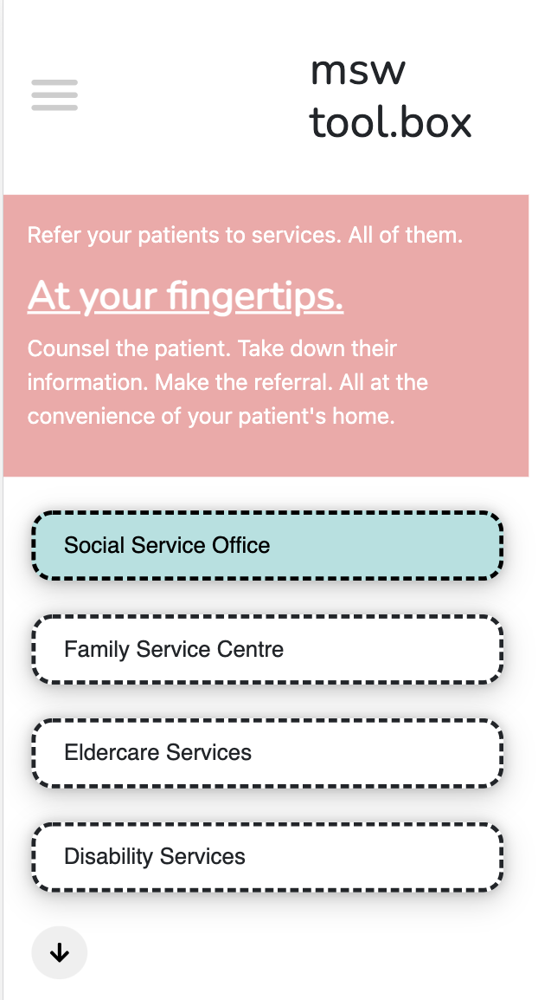
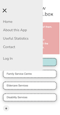
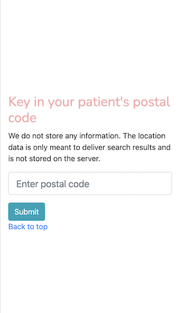
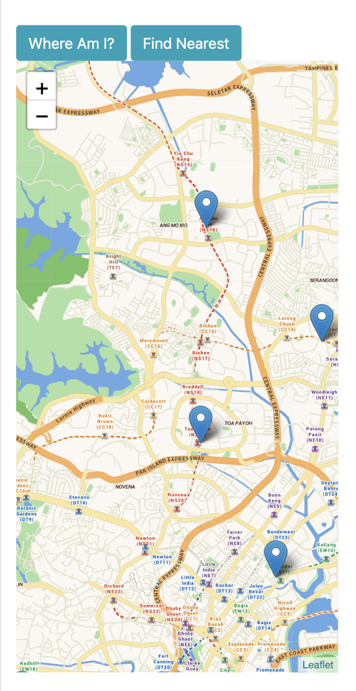

<<<<<<< HEAD
# Readme is currently work in progress.

## Project Summary

This is a toolbox to be used by Medical Social Workers (MSWs) to make referrals to community services while they are at their patients' homes.

## Strategy
=======
# How to Use

- msw-toolbox can be accessed at [http://hkgnp.github.io/msw-toolbox](http://hkgnp.github.io/msw-toolbox)
- As this is a prototype, please do not use it for actual services, and do not key in any sensitive patient data.

This app consists of 3 core functions:

## Ecomap:

When you are at your patient's home, you can use the ecomap locator to discover nearby care and social services.

## Useful Statistics:

Access the latest statistics from Data.gov.sg to see the latest trends.

## Referral System:

Reduce the time spent referring your patient to services by using the one-stop system. Select the service you want to refer your patient to, enter your patient's postal code or simply use the GPS on your mobile device, and the nearest service will appear. Simply click on the 'Refer' button, and fill out the form. Upon clicking submit, your referral will be immediately sent to the agency for processing.

# Project Summary

This toolbox is to be used by Medical Social Workers (MSWs) and other healthcare professionals at their patients' homes.
This is a toolbox to be used by Medical Social Workers (MSWs) to make referrals to community services while they are at their patients' homes.

This toolbox is a prototype that may be used by Medical Social Workers (MSWs) and other healthcare professionals, especially those working in the community. It hopes to be able to help them to:

- Discover a variety of social and care services near their patients' homes, without needing to research through several websites;
- Increase their effeciency when referrals their patients to social and care services, enabling them to do it at their patients' homes; and
- Make useful statistics easily available.

# Strategy
>>>>>>> dev

Part of a MSW's role is to link their patients up with community services as part of their care. This applies to both patients in the hospitals and clinics, and those who are at home. Currently, when a MSW identifies that a patient needs to be linked up with a community service, she may not know the services that are in the particular patient's committee. Even if she knows, she will need to do so when she is back in the office, despite having the necessary tools with her.

Useful information like health and social policies, and statistics are fragmented and found on different sites. Currently, MSWs need to navigate these different sites just to obtain the information, decreasing their productivity.

This application hopes to be able to solve the above problems, and ideally, as part of a wider eco-system of applications.

<<<<<<< HEAD
## Scope
=======
## User Stories

1. As a MSW, I want to be able to locate relevant community services that are near my patient so that I can share them without needing more than one visit.
2. As a MSW, I want to be able to refer my patient to these services from their homes, so that I do not need to return to my office to do so.
3. As a MSW, I want to be able to retrieve relevant policy information and statistics in a single place, so that I do not need to navigate several websites to do so.
4. As a MSW, I want the above functions to be available as a mobile app, because the work-issued devices have internet separation, and I will predominantly use my mobile or tablet to perform these functions.

# Scope
>>>>>>> dev

The app must be able to perform the following functions:

- Request and store a postal code to be converted to lat, long for processing.
- Request for user location in the form of lat, long.
- Request (from an API or local file) positional data of relevant community services.
- Compare the above coordinates to retrieve services nearby to the user's location or postal code.
- Store useful information and statistics, using graphs where necessary.

<<<<<<< HEAD
### User Stories

1. As a MSW, I want to be able to locate relevant community services that are near my patient so that I can share them without needing more than one visit.
2. As a MSW, I want to be able to refer my patient to these services from their homes, so that I do not need to return to my office to do so.
3. As a MSW, I want to be able to retrieve relevant policy information and statistics in a single place, so that I do not need to navigate several websites to do so.
4. As a MSW, I want the above functions to be available as a mobile app, because the work-issued devices have internet separation, and I will predominantly use my mobile or tablet to perform these functions.

## Structure

#### Search and Refer
=======
# Structure

## Ecomap Discoverer

1. User will be given an open map and be able to use the GPS on their mobile device to find out their exact position.
2. User will then be presented with toggle buttons to discover services that are nearby their location or around the island.

## Useful data and Statistics

1. User will be able to access a menu through the hamburger to be able to obtain relevant policy information and statistics.
2. Graphs will be used where necessary.

## Search and Refer
>>>>>>> dev

1. User will be presented with radio buttons to select the service that they would like to isolate.
2. User will be prompted with options to either (1) key in a postal code; or (2) use their device's GPS to retrieve their current location.
3. User will then be shown an interactive map that shows the above.
4. User will be able to refer to their marker of choice, and then click on a button to bring them to the referral page.
5. At the referral page, user will be presented with a form to key in the necessary referral information.
6. Upon submission, user will be presented with a HTML friendly version of the data that they can send to the community service via email.

<<<<<<< HEAD
#### Useful data and Statistics

1. User will be able to access a menu through the hamburger to be able to obtain relevant policy information and statistics.
2. Graphs will be used where necessary.

## Skeleton
=======
# Skeleton
>>>>>>> dev






<<<<<<< HEAD
## Surface

In progress.

## Build status

Currently in progress. Only the wireframe is completed at the moment.

## Code style
=======
# Code style
>>>>>>> dev

Code is formatted using Prettier (installed as an extension in VS Code).
[](https://github.com/prettier/prettier)

<<<<<<< HEAD
## Tech/framework used

HTML/ CSS/ Vanilla Javascript

<b>Built with</b>

- [VS Code](https://code.visualstudio.com/)

## Credits

In progress.

<!-- ## Features

What makes your project stand out?

## Code Example

Show what the library does as concisely as possible, developers should be able to figure out **how** your project solves their problem by looking at the code example. Make sure the API you are showing off is obvious, and that your code is short and concise.

## Installation

Provide step by step series of examples and explanations about how to get a development env running.

## API Reference

Depending on the size of the project, if it is small and simple enough the reference docs can be added to the README. For medium size to larger projects it is important to at least provide a link to where the API reference docs live.

## Tests

Describe and show how to run the tests with code examples.

## How to use?

If people like your project they’ll want to learn how they can use it. To do so include step by step guide to use your project.

## Contribute

Let people know how they can contribute into your project. A [contributing guideline](https://github.com/zulip/zulip-electron/blob/master/CONTRIBUTING.md) will be a big plus.

## Credits

Give proper credits. This could be a link to any repo which inspired you to build this project, any blogposts or links to people who contrbuted in this project.

#### Anything else that seems useful

## License

A short snippet describing the license (MIT, Apache etc)

MIT © [hkgnp]() -->
=======
# Deployment

`msw-toolbox` is deployed to Github Pages. MongoDB is used to store the referral information for retrieval, and the API used to communicate with MongoDB is hosted on Heroku. This API was specially created for this project and it can be found on [mswapi](https://github.com/hkgnp/mswapi). Dependency details for the API can be found on the page directly.

The dependencies for `msw-toolbox` can be found in the section below under "Tech/frameworks Used". Other than the CSS Menu (by Erik Terwan), Flat icons for the map pins, and geojson files, the other dependencies do not have to be downloaded as they are called through CDNs. Hence, if you would like to deploy this app on your own server, please ensure that the below files and folders are forked as well.

```
/geojson
/pins
/css/menu.css
```

Note: The geojson files are updated as of Jan 2021. There may be more updated datasets by the time you read this. However, the infograph data are obtained through a real-time API.

# Tech/frameworks Used

This app is made only possible thanks to the following technologies:

- [Github](https://www.github.com/)
- [HTML](https://en.wikipedia.org/wiki/HTML)
- [CSS](https://en.wikipedia.org/wiki/CSS)
- [Vanilla Javascript](https://en.wikipedia.org/wiki/JavaScript)
- [Leaflet](https://leafletjs.com/)
- [Leaflet Geometry Utility](https://github.com/makinacorpus/Leaflet.GeometryUtil)
- [Leaflet Omnivore](https://github.com/mapbox/leaflet-omnivore)
- [Bootstrap](https://getbootstrap.com/)
- [Google Fonts](https://fonts.google.com/)
- [Font Awesome](https://fontawesome.com/)
- [MongoDB](https://www.mongodb.com/cloud/atlas)
- [Heroku](https://www.heroku.com)
- [Axios](https://github.com/axios/axios)
- [ApexCharts.JS](https://apexcharts.com/)
- [CSS Menu](https://codepen.io/erikterwan/pen/EVzeRP)
- [Scroll Reveal](https://scrollrevealjs.org/api/reveal.html)
- [Flat Icons (for the pins)](https://www.flaticon.com)
  - [Freepik](https://www.freepik.com)
  - [Smashicons](https://smashicons.com)
  - [Pixel Perfect](https://icon54.com)
  - [srip](https://www.flaticon.com)
- Built with [VS Code](https://code.visualstudio.com/)

# API References

And it is also made only possible thanks to the painstaking work done by the following organisations:

- [OneMap](https://app.swaggerhub.com/apis/onemap-sg/new-onemap-api/1.0.3)
- [Data.gov.sg](https://data.gov.sg/)
- [Open Street Map](https://www.openstreetmap.org/)
- [Mapbox](https://www.mapbox.com/)

# Acknowledgments

- Mr Paul Chor
- Mr Ace Liang
- Mr Alexander Yan
- My wonderful classmates who have been part of this journey together:
  - Hidayah
  - Howard
  - Julius
  - Ryan
  - Ying Ru

# Testing

For assignment purposes, please refer to [this PDF]() for the test cases.
>>>>>>> dev
