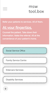
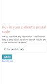

# Readme is currently work in progress.

## Project Summary

This is a toolbox to be used by Medical Social Workers (MSWs) to make referrals to community services while they are at their patients' homes.

## Strategy

Part of a MSW's role is to link their patients up with community services as part of their care. This applies to both patients in the hospitals and clinics, and those who are at home. Currently, when a MSW identifies that a patient needs to be linked up with a community service, she may not know the services that are in the particular patient's committee. Even if she knows, she will need to do so when she is back in the office, despite having the necessary tools with her.

Useful information like health and social policies, and statistics are fragmented and found on different sites. Currently, MSWs need to navigate these different sites just to obtain the information, decreasing their productivity.

This application hopes to be able to solve the above problems, and ideally, as part of a wider eco-system of applications.

## Scope

The app must be able to perform the following functions:

- Request and store a postal code to be converted to lat, long for processing.
- Request for user location in the form of lat, long.
- Request (from an API or local file) positional data of relevant community services.
- Compare the above coordinates to retrieve services nearby to the user's location or postal code.
- Store useful information and statistics, using graphs where necessary.

### User Stories

1. As a MSW, I want to be able to locate relevant community services that are near my patient so that I can share them without needing more than one visit.
2. As a MSW, I want to be able to refer my patient to these services from their homes, so that I do not need to return to my office to do so.
3. As a MSW, I want to be able to retrieve relevant policy information and statistics in a single place, so that I do not need to navigate several websites to do so.
4. As a MSW, I want the above functions to be available as a mobile app, because the work-issued devices have internet separation, and I will predominantly use my mobile or tablet to perform these functions.

## Structure

#### Search and Refer

1. User will be presented with radio buttons to select the service that they would like to isolate.
2. User will be prompted with options to either (1) key in a postal code; or (2) use their device's GPS to retrieve their current location.
3. User will then be shown an interactive map that shows the above.
4. User will be able to refer to their marker of choice, and then click on a button to bring them to the referral page.
5. At the referral page, user will be presented with a form to key in the necessary referral information.
6. Upon submission, user will be presented with a HTML friendly version of the data that they can send to the community service via email.

#### Useful data and Statistics

1. User will be able to access a menu through the hamburger to be able to obtain relevant policy information and statistics.
2. Graphs will be used where necessary.

## Skeleton

## Surface

In progress.

## Build status

Currently in progress. Only the wireframe is completed at the moment.

## Code style

Code is formatted using Prettier (installed as an extension in VS Code).

## Tech/framework used

HTML/ CSS/ Vanilla Javascript

<b>Built with</b>

- [VS Code](https://code.visualstudio.com/)

## Credits

In progress.

<!-- ## Features

What makes your project stand out?

## Code Example

Show what the library does as concisely as possible, developers should be able to figure out **how** your project solves their problem by looking at the code example. Make sure the API you are showing off is obvious, and that your code is short and concise.

## Installation

Provide step by step series of examples and explanations about how to get a development env running.

## API Reference

Depending on the size of the project, if it is small and simple enough the reference docs can be added to the README. For medium size to larger projects it is important to at least provide a link to where the API reference docs live.

## Tests

Describe and show how to run the tests with code examples.

## How to use?

If people like your project they’ll want to learn how they can use it. To do so include step by step guide to use your project.

## Contribute

Let people know how they can contribute into your project. A [contributing guideline](https://github.com/zulip/zulip-electron/blob/master/CONTRIBUTING.md) will be a big plus.

## Credits

Give proper credits. This could be a link to any repo which inspired you to build this project, any blogposts or links to people who contrbuted in this project.

#### Anything else that seems useful

## License

A short snippet describing the license (MIT, Apache etc)

MIT © [hkgnp]() -->
